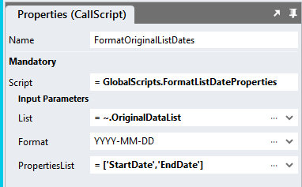

# Format List Date Property

A utility to format date properties in lists to a consistent format.

# Version 

1.0

# Global Script Setup
1. Create a Global Script called "FormatListDateProperties"
2. Add the input parameters below to the Global Script
   1. Format
   2. List
   3. PropertiesList
3. Add the output parameter below to the Global Script
   1. Return
4. Drag a *JavaScript* action into the script
5. Add the Javascript below unchanged into the JavaScript code property
```javascript
/* Stadium Script v1.0 https://github.com/stadium-software/utils-format-list-date-property */
let list = ~.Parameters.Input.List;
let format = ~.Parameters.Input.Format || "YYYY-MM-DD";
let properties = ~.Parameters.Input.PropertiesList;
return reformatDateProperties(list, properties, format);
function reformatDateProperties(list, properties, format) {
    if (!Array.isArray(list)) return [];
    const props = Array.isArray(properties) ? properties : [properties];
    return list.map(item => {
        if (!item || typeof item !== "object") return item;
        const updated = { ...item };
        props.forEach(prop => {
            if (updated[prop]) {
                const formatted = dayjs(updated[prop]).format(format);
                updated[prop] = formatted;
            }
        });
        return updated;
    });
}
```

6. Drag a *SetValue* action into the Global Script and place it under the *JavaScript* action
   1. Target: = ~.Parameters.Output.Return
   2. Value: = ~.Javascript

## Usage
1. Drag the script called "FormatListDateProperties" into a script or event handler
2. Enter values for the script input parameters
   1. Format: TheDayJS format you want the date property to become. Default is "YYYY-MM-DD".
   2. List: The list of items you want to format date properties for.
   3. PropertiesList: A list of properties that you want to format as dates (e.g. = ['DateOfBirth']).
4. Result: The script returns a List of items with the specified date properties formatted to the desired format.


